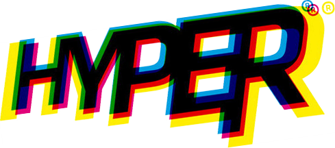
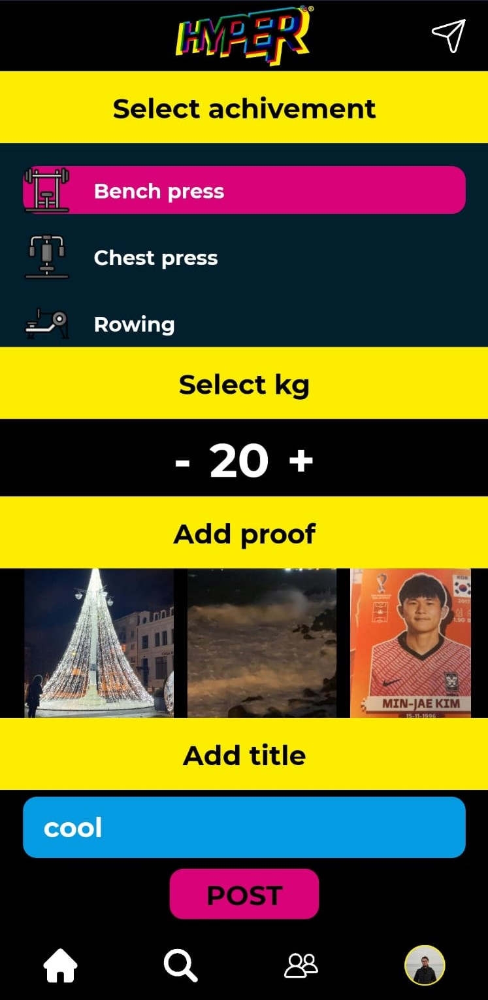
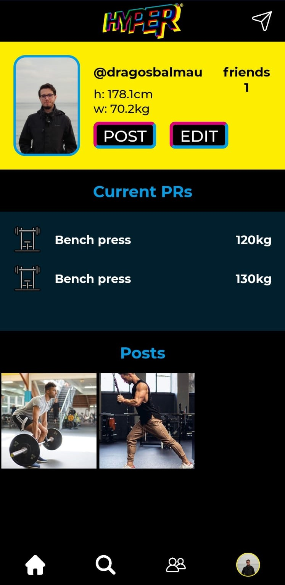
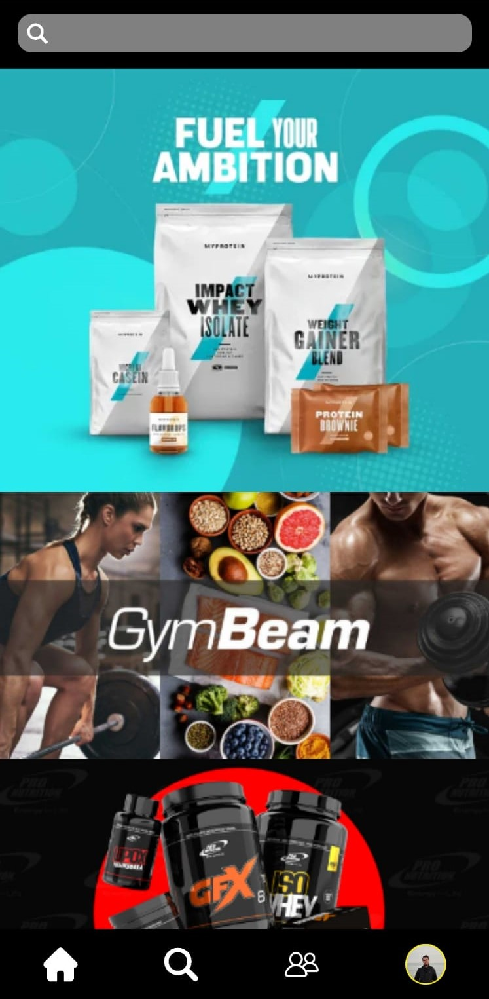
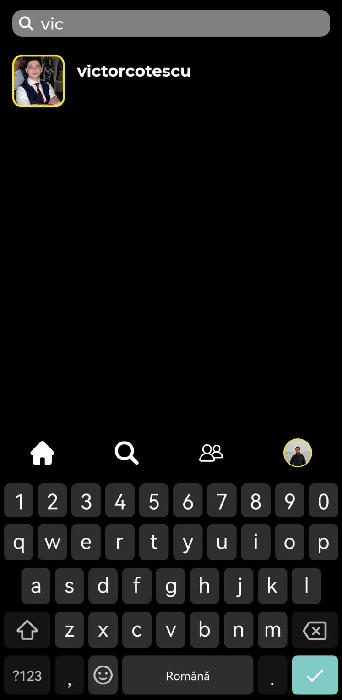
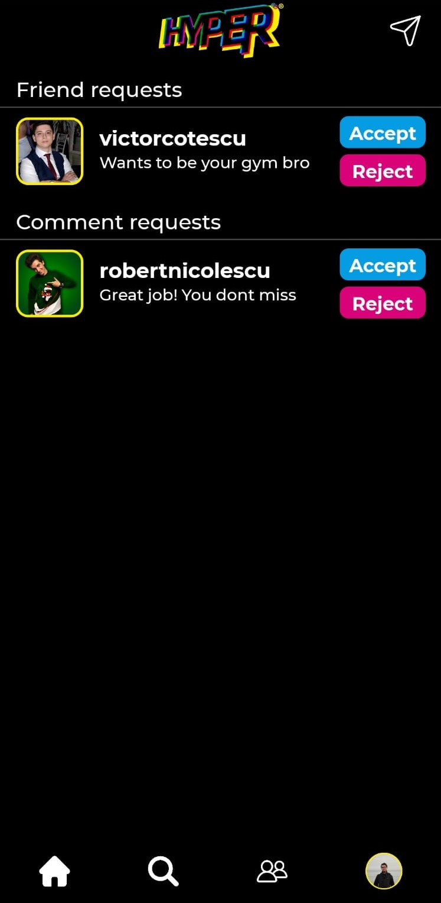
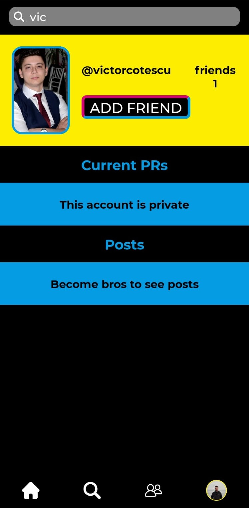
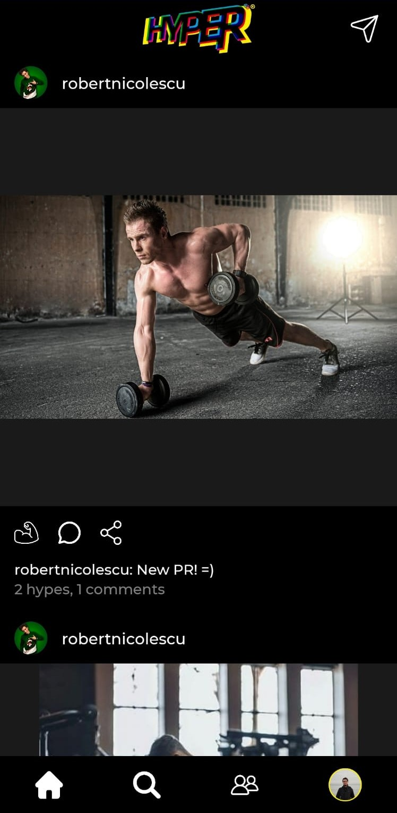

  

## 
Hyper - The Gym-Oriented Social Media Platform 🏋️‍♂️

Welcome to Hyper, where fitness meets social media! Get ready to take your gym experience to the next level with our specialized platform inspired by Instagram. Share your PRs, connect with fitness enthusiasts, and stay motivated on your fitness journey. Here's what Hyper has to offer:

📸 **Capture Your PRs, Inspire Others**: Share your personal records (PRs) with captivating descriptions and images. Showcase your achievements and inspire fellow fitness enthusiasts.

  

📊 **Track Your Progress**: Keep a record of your gym exercises and PRs. Track your progress, set new goals, and showcase your dedication.

  

🔍 **Discover and Connect**: Find workout buddies, fitness influencers, and like-minded individuals. Expand your fitness network and stay motivated together.

  
  
  

🔒 **Privacy Settings**: Customize your profile's privacy settings. Share your posts with friends-only, creating a supportive and secure fitness community.

  

🙌 **Engage and Interact**: Comment on posts, cheer each other on, and share workout tips. Engage in meaningful conversations and build connections.

  

🔥 **Personalized Fitness Feed**: Stay updated with the latest PRs and accomplishments from your friends. Get inspired, celebrate victories, and stay motivated.

  

Join the Hyper revolution and unleash your fitness potential. Start sharing your PRs, connecting with fitness enthusiasts, and embracing a community that shares your passion for fitness.

Get ready to lift, connect, and inspire on Hyper! 🚀
